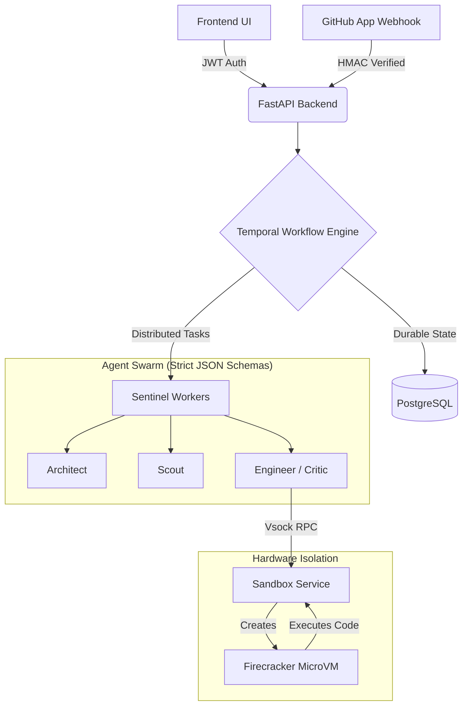

# Project Sentinel (Elite-State Architecture)

Autonomous DevSecOps swarm featuring hardware-isolated Firecracker microVMs, deterministic Temporal workflows, Pydantic-enforced LLM agents, and proper Role-Based Access Control (RBAC).

**🌟 [Live Demo (Frontend)](https://agent-swarms-2.vercel.app/)** · **[API (Backend)](https://agent-swarms-2.onrender.com/api/health)** · **🎥 [Watch the Demo Video](https://www.youtube.com/watch?v=s7jStzbIEBc)**

### Microsoft stack (hackathon)
- **Azure OpenAI** — `SENTINEL_LLM_PROVIDER=azure` + `AZURE_OPENAI_*` env vars
- **SARIF 2.1** — GitHub Advanced Security export: `GET /api/sessions/{id}/export/sarif`
- **Azure DevOps** — work items: `POST /api/sessions/{id}/export/azure`
- **Responsible AI policy** — `GET /api/sessions/{id}/policy`
- Details: [`docs/microsoft.md`](docs/microsoft.md)

## Use as GitHub Action
[](https://github.com/Akshat-coder2106/Agent-Swarms/actions)

You can easily integrate Project Sentinel into any of your own repositories using our GitHub Action!

### Workflow Snippet
Simply create a file at `.github/workflows/sentinel.yml` in your repo:
```yaml
name: Sentinel Audit
on: [push, pull_request]
jobs:
  audit:
    runs-on: ubuntu-latest
    permissions:
      contents: write
      pull-requests: write
    steps:
      - uses: actions/checkout@v4
      - uses: Akshat-coder2106/Agent-Swarms@main
        with:
          anthropic_api_key: ${{ secrets.ANTHROPIC_API_KEY }}
          github_token: ${{ secrets.GITHUB_TOKEN }}
```

### Setup Instructions
1. Navigate to your repository on GitHub.
2. Go to **Settings > Secrets and variables > Actions**.
3. Click **New repository secret**.
4. Name it `ANTHROPIC_API_KEY` and paste in your valid Anthropic API key.

### Pricing
| Repository Type | Cost |
| --- | --- |
| **Public Open Source** | **Free** (Uses GitHub-provided minutes) |
| **Private** | Dependent on your GitHub Actions billing plan |

*(Note: You will still be charged by Anthropic for LLM token usage based on the size of your repository).*

### Base Detection Capabilities
Sentinel ships with 11 deterministic detection rules and additionally offloads scanning to external providers if installed:

| Rule ID | Language | CWE | Severity | Description |
|---|---|---|---|---|
| `python.sql_injection.fstring` | Python | CWE-89 | HIGH | SQL Injection via f-strings |
| `python.unsafe_execution` | Python | CWE-94 | CRITICAL | Code Injection via `eval()`/`exec()` |
| `python.path_traversal.user_controlled_path` | Python | CWE-22 | HIGH | Path Traversal using unsanitized variables |
| `python.insecure_deserialization.pickle` | Python | CWE-502 | CRITICAL | Deserialization of untrusted data via `pickle` |
| `python.yaml_load` | Python | CWE-502 | HIGH | Unsafe YAML deserialization via `yaml.load()` |
| `python.weak_random.security` | Python | CWE-338 | MEDIUM | Insecure PRNG usage for security operations |
| `javascript.sql_injection.template` | JavaScript | CWE-89 | HIGH | SQL Injection via template literals |
| `javascript.xss.dom_sink` | JavaScript | CWE-79 | HIGH | Cross-Site Scripting via `innerHTML` / DOM manipulation |
| `javascript.unsafe_eval` | JavaScript | CWE-94 | CRITICAL | Code Injection via `eval()` |
| `secrets.hardcoded_credential` | Multi | CWE-798 | CRITICAL | Hardcoded Secrets / Credentials |
| `git.merge_conflict` | Multi | CWE-116 | LOW | Leftover Git Merge Conflict Markers |

## Architecture 



## Quick Start

```bash
python3 -m venv .venv
. .venv/bin/activate
pip install -e ".[dev]"
PYTHONPATH=backend python3 -m sentinel.api
```

In another terminal:

```bash
cd frontend
npm install
npm run dev
```

Open `http://127.0.0.1:5173` and use this demo repository:

```text
./examples/python-vulnerable-api
```

For optional AI-backed remediation and Critic commentary, add `ANTHROPIC_API_KEY`
to `.env` or your shell. Without that key, Sentinel still runs deterministic
rules and clearly labels the fallback path.

## One-Command Docker Demo

```bash
cp .env.example .env
docker compose up --build
```

Then open `http://127.0.0.1:5173`.

## CLI Demo

```bash
PYTHONPATH=backend python3 -m sentinel.cli examples/python-vulnerable-api
```

Add `--approve` to apply the validated patch to the demo repository.

## Security Defaults

- JWT-style HMAC bearer tokens are required for API calls.
- Session-scoped tokens are issued after session creation.
- The UI exposes auth context, token rotation, and the session-scoped bearer state.
- CORS origins are explicit and environment-configurable.
- Repository paths are constrained to configured allowed roots.
- Sandbox commands run without shell expansion and with a sanitized environment.
- Patch approval verifies original file content before writing.
- Rollback verifies patched file content before restoring original content.

## Live Deployment (Hackathon Requirement 4)

To deploy this project to the cloud for the 30-day requirement:
1. **Push to GitHub**: Commit this codebase to a public or private GitHub repository.
2. **Backend (Render)**: Connect your repository to Render and deploy using the provided `render.yaml`. You will need to supply the `ANTHROPIC_API_KEY` and `GITHUB_TOKEN` as environment variables in the Render dashboard.
3. **Frontend (Vercel)**: Set environment variables then redeploy:
   - `VITE_SENTINEL_API_URL` = `https://agent-swarms-2.onrender.com`
   - `VITE_DEFAULT_REPO_PATH` = `examples/python-vulnerable-api`

**Test Credentials**: You do not need a password to access the UI. Just click "Rotate Token" in the sidebar to authenticate as `local-operator`.

## Spec Coverage

This repository is a polished local MVP for the v4 blueprint, not the full enterprise deployment.

- Implemented: typed MCP contracts, repository ingestion, local code memory, LangGraph-compatible state execution, agent roles, sandbox validation, convergence scoring, SSE telemetry, approval, rollback, auth, and audit reports.
- AI-enabled when configured: Engineer and Critic call Anthropic when `ANTHROPIC_API_KEY` is present, with deterministic fallback for offline demos.
- MVP adapters: local semantic/graph memory stands in for Qdrant and Neo4j; local sandbox runner stands in for Firecracker and Wasmtime.
- Planned production integrations: managed Kubernetes, Temporal persistence, Kafka queues, external scanner CLIs, cloud secret mounting, and PagerDuty/JIRA wiring.

The UI reads `/api/system/capabilities` so judges can see the coverage boundary directly.

## Test Commands

```bash
PYTHONPATH=backend python3 -m unittest discover -s tests
python3 -m compileall backend tests examples/python-vulnerable-api
```
